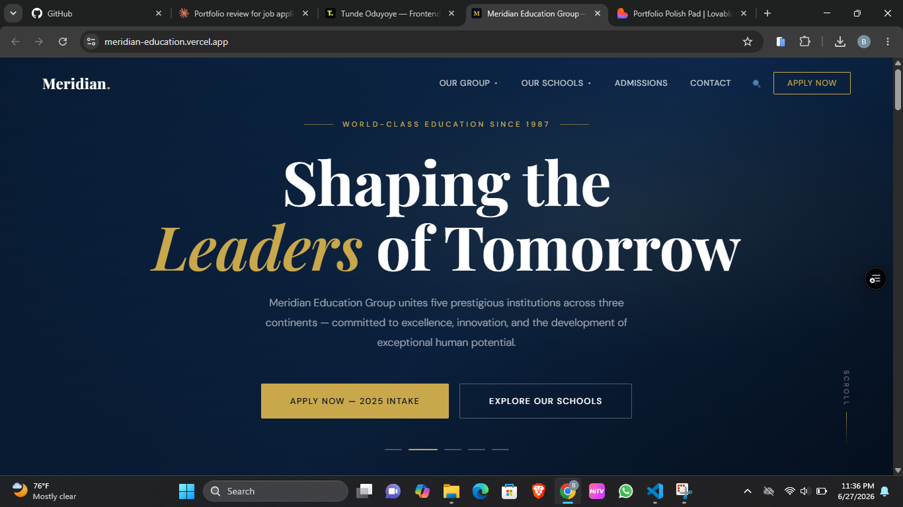

# T.Oduyoye — Frontend Developer Portfolio

> Personal portfolio website built with React + Vite + CSS Modules



## 🔗 Live Site

**[tunde-oduyoye.vercel.app](https://tunde-oduyoye.vercel.app)** *(update this once deployed)*

---

## ✨ Features

- **Cinematic page loader** — "T." logo reveal with progress bar on first load
- **Cursor spotlight** — subtle lime glow that follows mouse movement
- **Word-by-word headline animations** — staggered slide-up on every section heading
- **Parallax hero photo** — depth effect as you scroll
- **Scroll-triggered reveals** — directional fade-ins throughout (up, left, right)
- **Dual opposing marquee** — two rows of skills scrolling in opposite directions
- **Live project previews** — hover over project cards to see "View Live" overlay
- **Working contact form** — powered by EmailJS, sends directly to Gmail
- **CV download** — one-click download of resume
- **Fully responsive** — mobile, tablet, and desktop
- **Subtle noise texture** — grain overlay for depth on dark backgrounds
- **Custom text selection** — lime green highlight colour

---

## 🛠 Tech Stack

| Category | Technologies |
|---|---|
| Framework | React 18 |
| Build Tool | Vite |
| Styling | CSS Modules |
| Animations | Custom hooks (IntersectionObserver, RAF) |
| Email | EmailJS |
| Deployment | Vercel |
| Fonts | Syne (headings) · Inter (body) |

---

## 📁 Project Structure

```
portfolio/
├── public/
│   ├── favicon.svg
│   └── Tunde_Oduyoye_CV.docx
├── src/
│   ├── assets/
│   │   ├── photo.jpg          # Profile photo
│   │   ├── proj1.jpg          # Meridian Education screenshot
│   │   ├── proj2.jpg          # FreshDrop screenshot
│   │   └── proj3.jpg          # Noir & Ember screenshot
│   ├── components/
│   │   ├── Navbar.jsx         # Fixed nav with mobile hamburger
│   │   ├── Hero.jsx           # Landing section with parallax photo
│   │   ├── About.jsx          # About + feature cards
│   │   ├── Projects.jsx       # Project cards with image previews
│   │   ├── Experience.jsx     # Timeline of experience
│   │   ├── Skills.jsx         # Skill pills grouped by category
│   │   ├── Contact.jsx        # EmailJS contact form
│   │   ├── Footer.jsx         # Footer with social links
│   │   ├── Marquee.jsx        # Dual scrolling skill marquee
│   │   ├── PageLoader.jsx     # Intro loader animation
│   │   ├── CursorGlow.jsx     # Mouse follow spotlight
│   │   ├── FadeIn.jsx         # Scroll-triggered fade animation
│   │   ├── SplitText.jsx      # Word-by-word text animation
│   │   └── Counter.jsx        # Animated number counter
│   ├── hooks/
│   │   ├── useInView.js       # IntersectionObserver hook
│   │   └── useParallax.js     # Scroll parallax hook
│   ├── data.js                # All content (projects, skills, experience)
│   ├── App.jsx                # Root component
│   ├── main.jsx               # Entry point
│   └── index.css              # Global styles + CSS variables
├── index.html
├── package.json
└── vite.config.js
```

---

## 🚀 Getting Started

### Prerequisites
- Node.js 18+
- npm or yarn

### Installation

```bash
# Clone the repo
git clone https://github.com/Tunde-Oduyoye/T-portfolio.git
cd T-portfolio

# Install dependencies
npm install

# Start development server
npm run dev
```

Opens at `http://localhost:5173`

### Build for production

```bash
npm run build
npm run preview
```

---

## 📧 EmailJS Setup

The contact form uses [EmailJS](https://emailjs.com) to send emails without a backend.

Credentials are already configured in `src/components/Contact.jsx`. To use your own:

1. Create a free account at [emailjs.com](https://emailjs.com)
2. Add an Email Service (Gmail)
3. Create an Email Template with variables: `{{from_name}}`, `{{from_email}}`, `{{message}}`
4. Update these constants in `Contact.jsx`:

```js
const EMAILJS_SERVICE_ID  = 'your_service_id'
const EMAILJS_TEMPLATE_ID = 'your_template_id'
const EMAILJS_PUBLIC_KEY  = 'your_public_key'
```

---

## 🌍 Deployment

### Deploy to Vercel (recommended)

```bash
npm install -g vercel
vercel
```

Follow the prompts — live in ~2 minutes.

Or connect your GitHub repo directly at [vercel.com](https://vercel.com) for automatic deployments on every push.

---

## 📬 Contact

**Tunde Oduyoye**

- Email: [babatundeoduyoye53@gmail.com](mailto:babatundeoduyoye53@gmail.com)
- LinkedIn: [linkedin.com/in/babatunde-oduyoye](https://linkedin.com/in/babatunde-oduyoye)
- GitHub: [github.com/Tunde-Oduyoye](https://github.com/Tunde-Oduyoye)

---

## 📄 License

MIT — feel free to use this as inspiration for your own portfolio.

---

*Built with React & Tailwind CSS · Designed & developed by Tunde Oduyoye*
